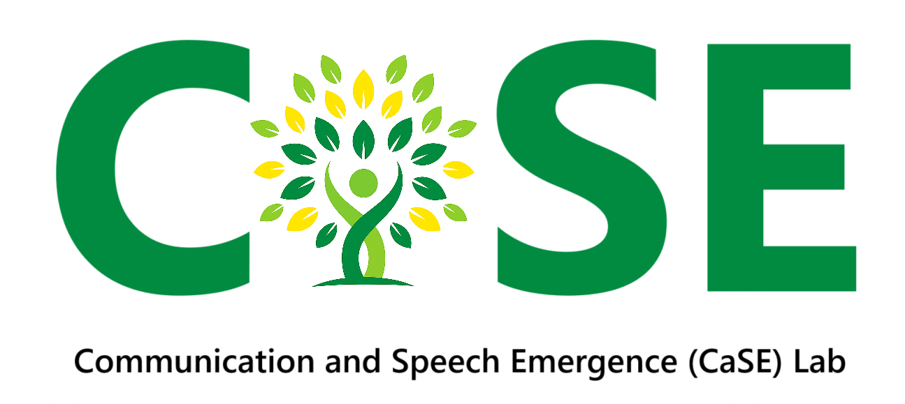
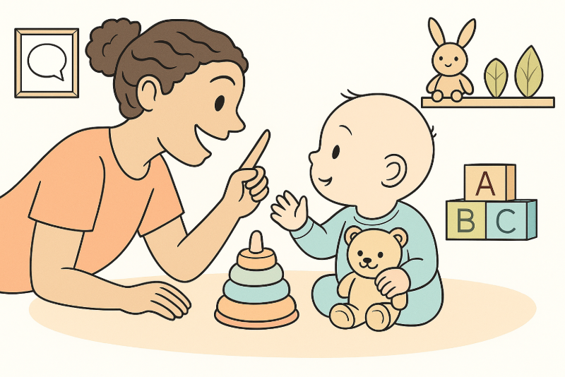

{.hero}

Welcome to the Communication and Speech Emergence Laboratory (CaSE Lab)! The CaSE Lab is led by [Dr. Helen Long](https://longhelenl.github.io/caseresearchlab/people/research-team/long_helen.html) and based in the Communication and Sciences Program in the [Department of Psychological Sciences](https://psychsciences.case.edu/) at Case Western Reserve University (CWRU) in Cleveland, Ohio.

**Early Communication and Cerebral Palsy**

Our research focuses on the early development of communication in [babies](https://longhelenl.github.io/caseresearchlab/publications.html#category=infant) with or at high risk for [cerebral palsy](https://longhelenl.github.io/caseresearchlab/publications.html#category=cerebral%20palsy). We study how children communicate across speech, [vocal sounds](https://longhelenl.github.io/caseresearchlab/publications.html#category=vocal%20development), gestures, facial expressions, and augmentative and alternative communication in their first years of life. Our goal is to help clinicians and families identify [speech](http://localhost:3284/publications.html#category=speech%20development) and [communication](http://localhost:3284/publications.html#category=communication) needs earlier and provide supports that support meaningful participation in everyday life.

Learn more about the [lab](https://longhelenl.github.io/caseresearchlab/mission.html) and meet more of the [team](https://longhelenl.github.io/caseresearchlab/people.html)!

## ✔️ Participate ✔️

The CaSE Lab conducts studies involving children, caregivers, speech-language pathologists, and other professionals. Visit our [participation page](https://longhelenl.github.io/caseresearchlab/participate.html) to learn about current opportunities to join a study or collaborate with our team.

## Our Research

🫛 **Early Communication Development in Cerebral Palsy**

The *Prelinguistic and Early Acquisition of Speech and Communication (PEAS)* Project is a longitudinal study of communication development from infancy through early childhood. We follow children with and without cerebral palsy over time using play-based assessments, caregiver reports, and daylong audio recordings collected in children’s everyday environments. This project will help us understand how early communication develops, which early behaviors may signal later communication needs, and how children’s developmental pathways differ across the first years of life.

📋 **Clinical Decision-Making in Early Intervention**

Assessing and supporting communication can be challenging when [babies](https://longhelenl.github.io/caseresearchlab/publications.html#category=infant) have motor, sensory, or other developmental differences. Current standardized tests may not fully capture what a child understands or how they communicate during everyday interactions.

We study how experienced early intervention [speech-language pathologists](https://longhelenl.github.io/caseresearchlab/publications.html#category=SLP%20services) assess communication, evaluate [speech](https://longhelenl.github.io/caseresearchlab/publications.html#category=speech%20development) and AAC options, adapt activities, collaborate with other professionals, and partner with caregivers. This work is being used to develop evidence-informed guidance for speech-language pathologists serving infants and toddlers with cerebral palsy and motor delays.

💬 **AAC and Caregiver-Centered Intervention**

Children can communicate through speech, gestures, facial expressions, signs, pictures, communication devices, and other forms of AAC. Early access to multiple communication options can help children express themselves, participate in family routines, and build relationships.

In partnership with United Cerebral Palsy of Greater Cleveland, we are currently studying caregiver experiences with an AAC program developed by SLPs at UCP called [Club chAT](https://www.ucpcleveland.org/services-for-children/therapy-services/club-chat/) and the effects of inclusive, interdisciplinary playgroups designed to support communication, movement, participation, and family well-being.

🌍 **Open Science Practices in Communication Sciences & Disorders (CSD)**

Through [CSDisseminate](https://www.csdisseminate.com), we develop and share resources related to open access, open data, preregistration, and other [open science](https://longhelenl.github.io/caseresearchlab/publications.html#category=open%20science) practices. Our collaborative research group also examines the supports researchers need to incorporate these practices into their work to improve the accessibility, transparency, and reproducibility of communication sciences and disorders research.

{.hero}
